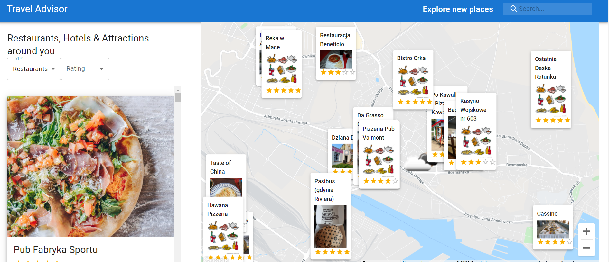

In this project, we used API's:

-   Google Maps API (Maps JavaScript API, Places Api)
-   Rapid API (Travel Advisor, Open Weather Map)
-   snazzymaps.com for map decoration
-   Heroku.com for deploying a project

dependencies installed:

-   axios,
-   google-map-react
-   @emotion/react
-   @emotion/styled
-   @material-ui/core
-   @material-ui/icons
-   @material-ui/lab
-   @material-ui/styles
-   @mui/material
-   @mui/styles
-   @react-google-maps/api
